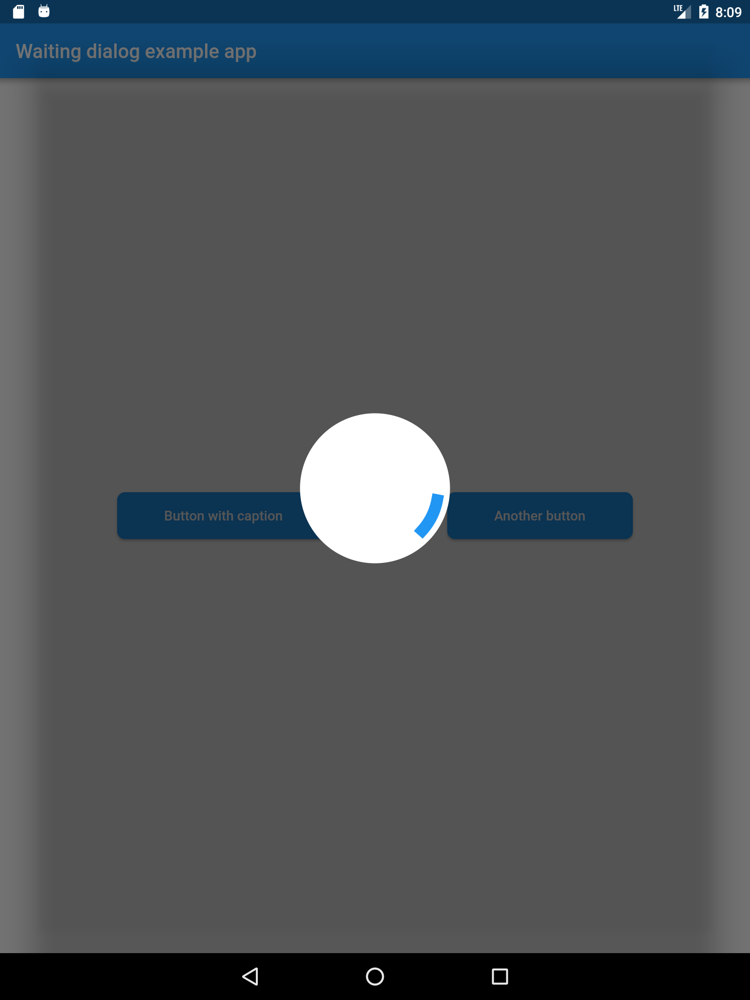

# waiting_dialog

Este **plugin** te ayudará visualmente a mostrar un [CircularProgressIndicator](https://docs.flutter.io/flutter/material/CircularProgressIndicator-class.html) mientras procesas una petición.

~~~dart
import 'dart:async';

import 'package:flutter/material.dart';
import 'package:waiting_dialog/waiting_dialog.dart';

...
Future _doLongProcess() async {
	// aquí simulamos una petición de 5 segundos
	// un ejemplo de su uso puede ser consumir un servicio REST/SOAP
	await Future.delayed(Duration(seconds: 5));
}

void _onPressed() {
	showWaitingDialog(
		context: _key.currentState.overlay.context,
		onWaiting: () async => await _doLongProcess(),
		strokeWidth: 12.0,
		onDone: () {
		  // una vez que termina la espera de procesar
		  print('is done!');
		});
}
...
~~~

